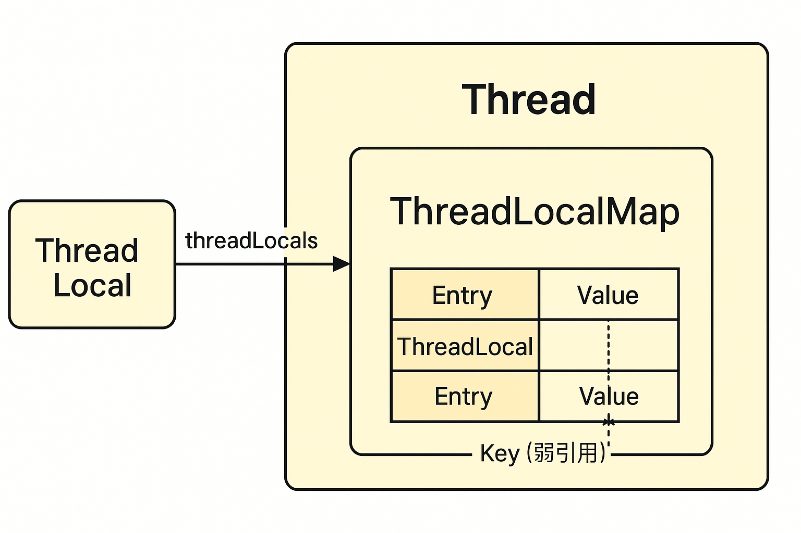

好的，我给你详细讲一下 **`ThreadLocal` 的原理和常见问题**，内容分三部分：

------

## 1. `ThreadLocal` 的作用

`ThreadLocal` 并不是解决多线程共享变量问题的工具，而是 **让每个线程有自己独立的变量副本**。
 这样就避免了多线程之间的竞争和同步。

简单例子：

```java
ThreadLocal<String> local = new ThreadLocal<>();

local.set("Hello");   // 给当前线程存储变量
String v = local.get();  // 只会拿到当前线程存储的值
local.remove();      // 清理
```

每个线程获取到的值 **相互独立**。

------

## 2. 原理（核心机制）

### 2.1 `Thread` 内部的 `ThreadLocalMap`

- 每个线程对象 `Thread` 中有一个成员变量：

  ```java
  ThreadLocal.ThreadLocalMap threadLocals;
  ```

- `ThreadLocalMap` 类似于一个 `HashMap`，但**Key 是 `ThreadLocal` 对象，Value 是你存储的值**。

也就是说：

- 当你调用 `local.set(value)` 时，实际上是把 `value` 放进了当前线程的 `threadLocals` 里。
- `local.get()` 时，会去当前线程的 `threadLocals` 查找。

### 2.2 为什么 Key 用弱引用？

`ThreadLocalMap` 的 **Key 是弱引用**（`WeakReference<ThreadLocal<?>>`）。

- 如果 `ThreadLocal` 对象没有外部强引用了，它就会被 GC 回收。
- 但是 **Value 不会自动回收**，因为 Value 是强引用。
- 所以可能出现 **Key = null 但 Value 还在内存里** 的情况，这就产生了**内存泄漏风险**。

------

## 3. 常见问题

### 3.1 内存泄漏

- **场景**：使用线程池时，线程不会销毁，`ThreadLocalMap` 里的数据就可能一直存在。
- **原因**：Key 是弱引用被回收后，Value 仍然强引用挂在 `Thread` 的 `ThreadLocalMap` 里。
- **解决办法**：
  - 使用完后调用 `remove()`。
  - 或者在 `finally` 里清理。

```java
try {
    local.set("value");
    // 业务逻辑
} finally {
    local.remove(); // 避免内存泄漏
}
```

------

### 3.2 值“脏读”

如果线程池复用线程，而你没清理旧值，新的任务可能读到之前遗留的数据。

例子：

- 线程 A 存入了用户信息，但没清理。
- 下次线程 B 被复用到另一个请求时，还能读到 A 的用户信息，造成严重 bug（比如用户数据串号）。

------

### 3.3 InheritableThreadLocal

- 普通 `ThreadLocal` **不能在子线程中继承父线程的值**。
- 如果需要，可以用 `InheritableThreadLocal`，会把父线程的值拷贝到子线程。
   但注意：在线程池中因为线程复用，值的继承可能出问题。

------

## 4. 总结

- **原理**：每个线程有一个 `ThreadLocalMap`，Key 是 `ThreadLocal` 的弱引用，Value 是存的值。
- **优点**：实现线程隔离，避免加锁。
- **缺点/风险**：
  1. 内存泄漏（Key 弱引用被回收但 Value 残留）。
  2. 线程池复用导致“脏数据”。
- **最佳实践**：用完 `remove()`，尤其在线程池环境下。

------

要不要我帮你画一个 **`ThreadLocal` 与 `Thread` 内部结构的关系图**，让你直观理解？