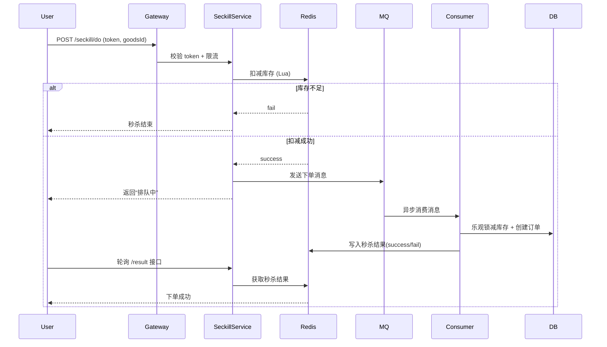

好的 ✅ 我来帮你系统讲解 **秒杀系统的 Java 设计与实现方案**，覆盖从架构、数据库、并发控制、缓存、队列、削峰、防刷、防超卖、落库设计到最终一致性，适合你作为后端开发（Spring Boot / MyBatis / Redis / MQ 技术栈）来落地。

------

## 🧩 一、秒杀业务核心特征

| 特征       | 描述                                 |
| ---------- | ------------------------------------ |
| 高并发     | 短时间内大量请求涌入（可能上万 QPS） |
| 库存少     | 商品数量有限（几十、几百件）         |
| 活动短     | 持续几分钟甚至几秒钟                 |
| 结果异步   | 前端用户体验要快，但订单确认可能延迟 |
| 安全要求高 | 防止脚本抢购、重复下单、超卖等问题   |

------

## 🧠 二、整体架构设计（总览）

```
          ┌──────────────────────────────┐
          │          用户浏览器/APP       │
          └──────────────┬───────────────┘
                         │
                         ▼
             [Nginx + 限流 + Token桶防刷]
                         │
                         ▼
           [秒杀网关服务/ActivityGatewayService]
                         │
         ┌───────────────┴────────────────┐
         ▼                                ▼
 [Redis 缓存预减库存]             [MQ 消息队列削峰]
         │                                │
         ▼                                ▼
  [下单服务OrderService]          [异步下单消费者]
         │                                │
         ▼                                ▼
     [数据库 MySQL]                 [库存/订单表更新]
```

------

## ⚙️ 三、核心模块分层设计

### 1️⃣ 前端层（Web/PC）

- 用户点击“立即秒杀”
- 前端需先 **获取秒杀 token**（后端签名防刷）
- 再携带 token 调用秒杀接口
- 显示“排队中”或“秒杀结果查询中”

### 2️⃣ 网关层（Nginx + Spring Gateway）

- 限流（IP + 用户级）
- 鉴权（登录校验 + 签名 token）
- 防止接口直接暴露

### 3️⃣ 业务层（Spring Boot）

关键职责：

- 校验活动有效性
- 校验库存（Redis 原子递减）
- 写入消息队列（MQ）异步下单
- 异步消费者执行下单入库逻辑（减库存 + 创建订单）
- 订单状态可查询（轮询）

------

## 💾 四、数据库设计

### 商品表 `t_goods`

| 字段          | 含义                         |
| ------------- | ---------------------------- |
| id            | 商品ID                       |
| name          | 商品名                       |
| stock         | 库存                         |
| price         | 原价                         |
| seckill_price | 秒杀价                       |
| version       | 乐观锁版本号（防止并发修改） |

### 订单表 `t_order`

| 字段        | 含义                             |
| ----------- | -------------------------------- |
| id          | 主键                             |
| user_id     | 用户                             |
| goods_id    | 商品                             |
| status      | 状态（0:待支付, 1:成功, 2:失败） |
| create_time | 创建时间                         |

### 秒杀活动表 `t_seckill_activity`

| 字段            | 含义       |
| --------------- | ---------- |
| id              | 活动ID     |
| goods_id        | 商品ID     |
| start_time      | 开始时间   |
| end_time        | 结束时间   |
| total_stock     | 秒杀总库存 |
| remaining_stock | 剩余库存   |

------

## 🚀 五、Redis 设计与并发控制

### 1️⃣ 预热阶段

- 把商品信息和库存提前加载进 Redis：

  ```bash
  key: seckill:goods:{id} -> 商品信息
  key: seckill:stock:{id} -> 库存数量
  ```

- 活动未开始：接口直接返回 “活动未开始”

### 2️⃣ 秒杀阶段

- 使用 Redis **原子递减库存**：

  ```java
  Long stock = redis.decr("seckill:stock:" + goodsId);
  if (stock < 0) {
      // 回滚库存 + 返回秒杀结束
      redis.incr("seckill:stock:" + goodsId);
      return "库存不足";
  }
  ```

- 写入 MQ（异步下单）：

  ```java
  mq.send("SECKILL_ORDER", new OrderMessage(userId, goodsId));
  ```

### 3️⃣ Redis Lua 脚本（原子校验 + 扣减）

可防止并发超卖：

```lua
local stock = redis.call('get', KEYS[1])
if (not stock) then return -1 end
if (tonumber(stock) <= 0) then return 0 end
redis.call('decr', KEYS[1])
return 1
```

------

## 🧳 六、消息队列（削峰异步化）

### 1️⃣ MQ 选型

- RabbitMQ / RocketMQ / Kafka 都可
- 秒杀写队列削峰作用：**异步下单 + 控制数据库写入速度**

### 2️⃣ 生产者

```java
OrderMessage msg = new OrderMessage(userId, goodsId);
rabbitTemplate.convertAndSend("seckill.exchange", "seckill.key", msg);
```

### 3️⃣ 消费者

```java
@RabbitListener(queues = "seckill.queue")
public void handleSeckillOrder(OrderMessage msg) {
    // 查询库存
    Goods goods = goodsMapper.selectById(msg.getGoodsId());
    if (goods.getStock() <= 0) return;

    // 乐观锁扣减库存
    int update = goodsMapper.reduceStock(goods.getId(), goods.getVersion());
    if (update == 1) {
        // 成功减库存
        orderMapper.insert(msg.toOrder());
    }
}
```

------

## 🧱 七、防重、防刷、防超卖设计

| 场景     | 方案                                                        |
| -------- | ----------------------------------------------------------- |
| 重复秒杀 | Redis setnx 用户-商品标识 `seckill:user:{userId}:{goodsId}` |
| 超卖     | Redis 原子扣减 + DB 乐观锁                                  |
| 恶意请求 | 秒杀 token + 限流（RateLimiter）                            |
| 压力过大 | MQ 削峰 + 限制并发连接                                      |
| 过期库存 | 延时队列 + 状态恢复机制                                     |

------

## 🔄 八、乐观锁方案（数据库层）

MySQL 更新库存语句：

```sql
UPDATE t_goods 
SET stock = stock - 1, version = version + 1
WHERE id = #{goodsId} AND version = #{version} AND stock > 0;
```

若返回更新行数 = 0 → 表示抢购失败。

------

## 📡 九、最终一致性（库存、订单）

- 下单成功：Redis 库存 -1，数据库库存 -1；
- 若 MQ 消费失败：
  - 通过消息补偿机制或定时任务扫描 Redis/DB 对账；
- 若订单未支付超时：
  - 使用延迟队列 / 定时任务回滚库存。

------

## 🧰 十、安全与优化要点

| 模块  | 优化点                           |
| ----- | -------------------------------- |
| Redis | 开启 Pipeline + Lua 原子操作     |
| MQ    | 异步确认、持久化消息             |
| MySQL | 读写分离、分表分库（按活动 ID）  |
| 缓存  | 热点 key 自动过期 + 本地缓存兜底 |
| 限流  | Guava RateLimiter / Redis 令牌桶 |
| 安全  | 秒杀签名参数（防止脚本伪造）     |

------

## ✅ 十一、典型流程图（文本版）

```
用户点击“立即秒杀”
    │
    ▼
[前端校验 + 获取秒杀token]
    │
    ▼
[后端检查活动有效性 + Redis库存扣减(Lua)]
    │
    ├──> 扣减失败 → 返回“秒杀结束”
    │
    └──> 扣减成功 → 写入MQ
                     │
                     ▼
           [MQ消费者异步下单]
                     │
                     ├──> DB 扣减库存（乐观锁）
                     ├──> 创建订单记录
                     └──> Redis更新状态
```

------

## 🧪 十二、测试要点

- ✅ 并发压测（JMeter / wrk）
- ✅ Redis 原子性验证（库存一致）
- ✅ MQ 消息可靠性测试
- ✅ 超时订单回滚测试
- ✅ 防刷验证（token、限流）
- ✅ 异常断电 / 服务宕机恢复测试

------

## 🧩 十三、Spring Boot 模块划分建议

| 模块              | 描述                                       |
| ----------------- | ------------------------------------------ |
| `seckill-api`     | 控制器层，暴露 REST API                    |
| `seckill-service` | 核心逻辑层（库存扣减、订单写入、消息发送） |
| `seckill-mq`      | MQ 生产与消费模块                          |
| `seckill-cache`   | Redis 缓存接口与 Lua 脚本                  |
| `seckill-job`     | 定时任务模块（订单过期回滚）               |

------

如果你希望我帮你：

- 生成 **完整的 Java 实现模板（Spring Boot + Redis + RabbitMQ）**
- 或者画出 **详细的秒杀时序图（Mermaid / PlantUML）**

请告诉我你想要哪个版本（✅ 代码模板 还是 🧩 流程图版）？


好的 ✅ 我来为你详细拆解 **「秒杀系统 Java 实现的完整流程」**，从 **请求入口 → Redis 扣减 → MQ 异步下单 → DB 持久化 → 状态查询** 全链路剖析，让你能清晰理解每一个模块之间的职责、数据流转和线程模型。

------

## 🧭 一、总体目标

设计一个高并发可扩展的 **秒杀系统**，实现：

- 防超卖、防重复抢购
- Redis 预减库存
- MQ 异步下单削峰
- 数据库最终一致性
- 秒杀状态可查询

------

## 🚦 二、完整业务流程（从请求到落库）

### 🧩 阶段 1：活动预热（秒杀前准备）

1. **管理员发布秒杀活动**

   - 写入 `t_seckill_activity` 表
   - 指定商品 ID、活动时间、秒杀价、库存数量

2. **系统启动定时任务 / 手动预热**

   - 把商品与库存信息预加载到 Redis：

   ```bash
   seckill:goods:{id}  → 商品详情
   seckill:stock:{id}  → 剩余库存数量
   ```

3. **Redis 设置活动时间窗口**

   ```bash
   seckill:time:{id} = {startTime, endTime}
   ```

------

### ⚙️ 阶段 2：前端发起请求（带签名 Token）

1. 用户访问商品页面
    → 前端请求一个秒杀 `token`（后端签名生成）

   ```java
   token = sign(userId, goodsId, salt)
   ```

   后端返回 token 并存 Redis：

   ```bash
   seckill:token:{userId}:{goodsId} = token (5分钟有效)
   ```

2. 前端点击「立即秒杀」按钮

   - 请求携带 token 和 userId, goodsId 到 `/seckill/do` 接口

------

### 🔐 阶段 3：网关层过滤（防刷 + 限流）

Nginx 或 Spring Cloud Gateway：

- **限流**：同一 IP 每秒不超过 N 次
- **鉴权**：校验登录与 token 合法性
- **防重**：用户多次点击直接拦截

若检测失败：

```json
{"code":403, "msg":"非法请求"}
```

------

### ⚡ 阶段 4：后端秒杀接口（核心逻辑）

Controller 示例：

```java
@PostMapping("/do")
public Result doSeckill(@RequestParam Long goodsId, @RequestParam String token) {
    if (!tokenService.verifyToken(userId, goodsId, token)) {
        return Result.error("非法请求");
    }
    return seckillService.secKill(userId, goodsId);
}
```

------

### 🚀 阶段 5：Redis 扣减库存（原子性）

`SeckillService.secKill()`：

```java
Long stock = redisTemplate.opsForValue().decrement("seckill:stock:" + goodsId);
if (stock < 0) {
    // 回滚库存
    redisTemplate.opsForValue().increment("seckill:stock:" + goodsId);
    return Result.error("库存不足");
}
```

> **说明：** 这个操作是原子性的，Redis 的 `decr()` 自带并发安全。
>  若需更严格控制（校验活动有效期 + 防重），可以使用 **Lua 脚本**：

#### ✅ Lua 脚本原子扣减

```lua
local stock = redis.call('get', KEYS[1])
if not stock then
  return -1
end
if tonumber(stock) <= 0 then
  return 0
end
redis.call('decr', KEYS[1])
return 1
```

Java 调用：

```java
Long result = redisScript.execute(redisConnection, Collections.singletonList("seckill:stock:" + goodsId));
```

------

### 🧵 阶段 6：异步化削峰（MQ 投递）

扣减成功后，不直接写数据库，而是**发送异步下单消息**：

```java
OrderMessage msg = new OrderMessage(userId, goodsId);
rabbitTemplate.convertAndSend("seckill.exchange", "seckill.key", msg);
```

队列结构：

```
Exchange: seckill.exchange
Queue:    seckill.queue
RoutingKey: seckill.key
```

MQ 的作用：

- 削峰限流（防止数据库写入暴增）
- 异步落库（下单与扣库存后台完成）

------

### 🧰 阶段 7：消息消费者（异步下单）

消费者监听队列：

```java
@RabbitListener(queues = "seckill.queue")
public void handleSeckillOrder(OrderMessage msg) {
    Long userId = msg.getUserId();
    Long goodsId = msg.getGoodsId();

    // 防止重复下单
    if (orderMapper.exists(userId, goodsId)) return;

    // 查询库存（DB）
    Goods goods = goodsMapper.selectById(goodsId);
    if (goods.getStock() <= 0) return;

    // 乐观锁更新库存
    int result = goodsMapper.reduceStock(goodsId, goods.getVersion());
    if (result > 0) {
        // 创建订单
        orderMapper.insert(new Order(userId, goodsId, goods.getSeckillPrice()));
        redisTemplate.opsForValue().set("seckill:result:" + userId + ":" + goodsId, "success");
    } else {
        redisTemplate.opsForValue().set("seckill:result:" + userId + ":" + goodsId, "fail");
    }
}
```

------

### 💾 阶段 8：数据库更新（乐观锁防超卖）

MyBatis Mapper：

```sql
UPDATE t_goods
SET stock = stock - 1, version = version + 1
WHERE id = #{id} AND version = #{version} AND stock > 0;
```

若 `update = 0`，说明并发冲突或库存不足。

------

### 🔄 阶段 9：秒杀结果查询接口（异步反馈）

前端调用：

```java
GET /seckill/result?userId=1&goodsId=1001
```

后端查询 Redis：

```java
String result = redisTemplate.opsForValue().get("seckill:result:" + userId + ":" + goodsId);
if ("success".equals(result)) return "下单成功";
if ("fail".equals(result)) return "秒杀失败";
return "排队中";
```

> 用户体验优化：前端先返回“排队中”，后轮询结果接口。

------

### 🕓 阶段 10：超时未支付回滚

1. 订单创建后状态为 `WAIT_PAY`

2. 若超过15分钟未支付：

   - 延迟队列 / 定时任务扫描：

     ```sql
     UPDATE t_order SET status='CANCEL' WHERE status='WAIT_PAY' AND TIMESTAMPDIFF(MINUTE, create_time, NOW()) > 15;
     ```

   - Redis 库存恢复：

     ```java
     redisTemplate.opsForValue().increment("seckill:stock:" + goodsId);
     ```

   - DB 库存回滚（update +1）

------

### 🔄 阶段 11：一致性与补偿机制

1. MQ 投递失败：
   - 启用 **ConfirmCallback** + **Retry** 机制
   - 未确认消息写入 `t_mq_log`，由定时任务重发
2. MQ 消费失败：
   - 写入死信队列（DLQ）
   - 后台人工/定时任务补偿执行
3. Redis 与数据库不一致：
   - 定期对账任务：扫描库存差异，自动修正

------

## 🧠 十二、整体时序图（Mermaid）



------

## 🧩 十三、关键技术点总结

| 模块   | 技术点               | 说明                   |
| ------ | -------------------- | ---------------------- |
| 缓存层 | Redis Lua 脚本       | 原子性扣减库存         |
| 队列层 | RabbitMQ             | 异步削峰、保证最终一致 |
| 数据层 | MySQL 乐观锁         | 防止超卖               |
| 安全层 | Token 签名           | 防刷、防伪造           |
| 限流层 | Gateway / Redis 限流 | 控制接口压力           |
| 任务层 | 延时队列 / 定时任务  | 支付超时回滚           |
| 容错层 | MQ 重试 + 死信队列   | 保证消息可靠性         |
| 用户层 | 异步轮询结果         | 提升体验               |

------

如果你希望我继续生成：

1. 🧱 **Spring Boot + Redis + MQ 实际代码模板（Controller + Service + MQ 消费者）**
2. 🪶 或者 **整套时序图 + 架构图（可导出 PlantUML）**

请告诉我你想要哪一个，我可以帮你直接生成落地实现。